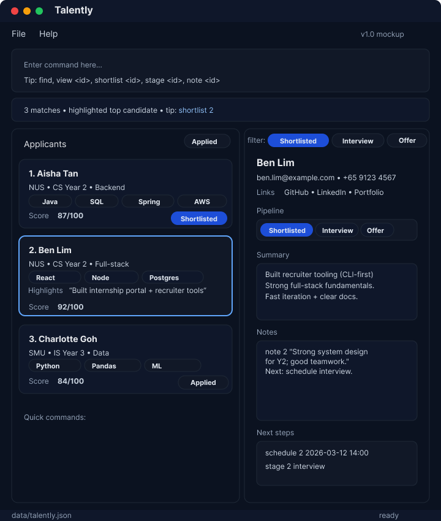

* Talently is a project based on the AddressBook-Level3 project created by the [SE-EDU initiative](https://se-education.org)
  * as a academic exercise in practicing and demonstrating the collaborators' software engineering competencies.
* This an ongoing software project for a desktop application used for managing the contact details, amongst other things, of a startup recruiter's applicants during the hiring process.
  * It is **written in OOP fashion**. It provides a **reasonably well-written** code base without being overwhelmingly big.
  * It comes with a **reasonable level of user and developer documentation**.
* It is named `Talently` because it helps users effectively keep track of the talents that they are interested in interviewing and hiring.
