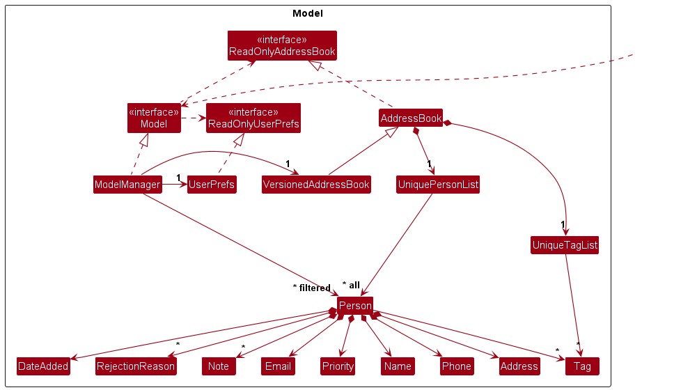
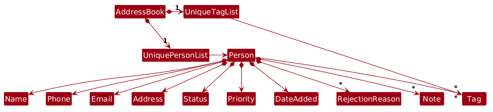
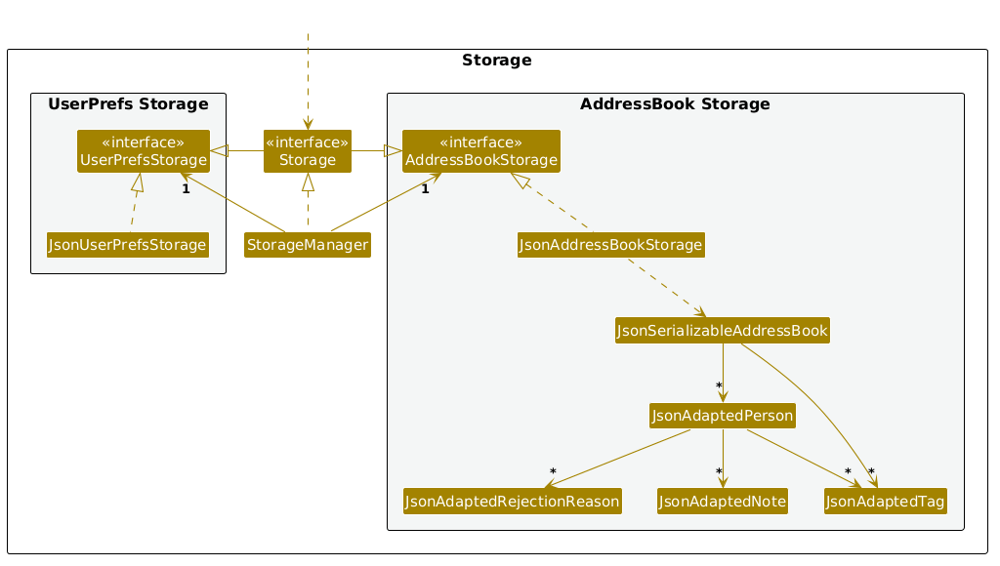
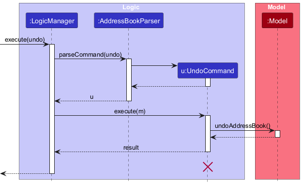

* Table of Contents
{:toc}

--------------------------------------------------------------------------------------------------------------------

## **Acknowledgements**

* {list here sources of all reused/adapted ideas, code, documentation, and third-party libraries -- include links to the original source as well}

--------------------------------------------------------------------------------------------------------------------

## **Setting up, getting started**

Refer to the guide [_Setting up and getting started_](SettingUp.md).

--------------------------------------------------------------------------------------------------------------------

## **Design**

:bulb: **Tip:** The `.puml` files used to create diagrams are in this document `docs/diagrams` folder. Refer to the [_PlantUML Tutorial_ at se-edu/guides](https://se-education.org/guides/tutorials/plantUml.html) to learn how to create and edit diagrams.

### Architecture

The ***Architecture Diagram*** given above explains the high-level design of the App.

Given below is a quick overview of main components and how they interact with each other.

**Main components of the architecture**

**`Main`** (consisting of classes [`Main`](https://github.com/se-edu/addressbook-level3/tree/master/src/main/java/seedu/address/Main.java) and [`MainApp`](https://github.com/se-edu/addressbook-level3/tree/master/src/main/java/seedu/address/MainApp.java)) is in charge of the app launch and shut down.
* At app launch, it initializes the other components in the correct sequence, and connects them up with each other.
* At shut down, it shuts down the other components and invokes cleanup methods where necessary.

The bulk of the app's work is done by the following four components:

* [**`UI`**](#ui-component): The UI of the App.
* [**`Logic`**](#logic-component): The command executor.
* [**`Model`**](#model-component): Holds the data of the App in memory.
* [**`Storage`**](#storage-component): Reads data from, and writes data to, the hard disk.

[**`Commons`**](#common-classes) represents a collection of classes used by multiple other components.

**How the architecture components interact with each other**

The *Sequence Diagram* below shows how the components interact with each other for the scenario where the user issues the command `delete 1`.

Each of the four main components (also shown in the diagram above),

* defines its *API* in an `interface` with the same name as the Component.
* implements its functionality using a concrete `{Component Name}Manager` class (which follows the corresponding API `interface` mentioned in the previous point.

For example, the `Logic` component defines its API in the `Logic.java` interface and implements its functionality using the `LogicManager.java` class which follows the `Logic` interface. Other components interact with a given component through its interface rather than the concrete class (reason: to prevent outside component's being coupled to the implementation of a component), as illustrated in the (partial) class diagram below.

The sections below give more details of each component.

### UI component

The **API** of this component is specified in [`Ui.java`](https://github.com/se-edu/addressbook-level3/tree/master/src/main/java/seedu/address/ui/Ui.java)

The UI consists of a `MainWindow` that is made up of parts e.g.`CommandBox`, `ResultDisplay`, `PersonListPanel`, `StatusBarFooter` etc. All these, including the `MainWindow`, inherit from the abstract `UiPart` class which captures the commonalities between classes that represent parts of the visible GUI.

The `UI` component uses the JavaFx UI framework. The layout of these UI parts are defined in matching `.fxml` files that are in the `src/main/resources/view` folder. For example, the layout of the [`MainWindow`](https://github.com/se-edu/addressbook-level3/tree/master/src/main/java/seedu/address/ui/MainWindow.java) is specified in [`MainWindow.fxml`](https://github.com/se-edu/addressbook-level3/tree/master/src/main/resources/view/MainWindow.fxml)

The `UI` component,

* executes user commands using the `Logic` component.
* listens for changes to `Model` data so that the UI can be updated with the modified data.
* keeps a reference to the `Logic` component, because the `UI` relies on the `Logic` to execute commands.
* depends on some classes in the `Model` component, as it displays `Person` object residing in the `Model`.

### Logic component

**API** : [`Logic.java`](https://github.com/se-edu/addressbook-level3/tree/master/src/main/java/seedu/address/logic/Logic.java)

Here's a (partial) class diagram of the `Logic` component:

The sequence diagram below illustrates the interactions within the `Logic` component, taking `execute("delete 1")` API call as an example.

:information_source: **Note:** The lifeline for `DeleteCommandParser` should end at the destroy marker (X) but due to a limitation of PlantUML, the lifeline continues till the end of diagram.

How the `Logic` component works:

1. When `Logic` is called upon to execute a command, it is passed to an `AddressBookParser` object which in turn creates a parser that matches the command (e.g., `DeleteCommandParser`) and uses it to parse the command.
1. This results in a `Command` object (more precisely, an object of one of its subclasses e.g., `DeleteCommand`) which is executed by the `LogicManager`.
1. The command can communicate with the `Model` when it is executed (e.g. to delete a person). 
   Note that although this is shown as a single step in the diagram above (for simplicity), in the code it can take several interactions (between the command object and the `Model`) to achieve.
1. The result of the command execution is encapsulated as a `CommandResult` object which is returned back from `Logic`.

Here are the other classes in `Logic` (omitted from the class diagram above) that are used for parsing a user command:

How the parsing works:
* When called upon to parse a user command, the `AddressBookParser` class creates an `XYZCommandParser` (`XYZ` is a placeholder for the specific command name e.g., `AddCommandParser`) which uses the other classes shown above to parse the user command and create a `XYZCommand` object (e.g., `AddCommand`) which the `AddressBookParser` returns back as a `Command` object.
* All `XYZCommandParser` classes (e.g., `AddCommandParser`, `DeleteCommandParser`, ...) inherit from the `Parser` interface so that they can be treated similarly where possible e.g, during testing.

### Model component
**API** : [`Model.java`](https://github.com/se-edu/addressbook-level3/tree/master/src/main/java/seedu/address/model/Model.java)

The `Model` component,

* stores the address book data i.e., all `Person` objects (which are contained in a `UniquePersonList` object).
* stores the currently 'selected' `Person` objects (e.g., results of a search query) as a separate _filtered_ list which is exposed to outsiders as an unmodifiable `ObservableList<Person>` that can be 'observed' e.g. the UI can be bound to this list so that the UI automatically updates when the data in the list change.
* stores a `UserPref` object that represents the user’s preferences. This is exposed to the outside as a `ReadOnlyUserPref` objects.
* does not depend on any of the other three components (as the `Model` represents data entities of the domain, they should make sense on their own without depending on other components)

:information_source: **Note:** An alternative (arguably, a more OOP) model is given below. It has a `Tag` list in the `AddressBook`, which `Person` references. This allows `AddressBook` to only require one `Tag` object per unique tag, instead of each `Person` needing their own `Tag` objects. 

### Storage component

**API** : [`Storage.java`](https://github.com/se-edu/addressbook-level3/tree/master/src/main/java/seedu/address/storage/Storage.java)

The `Storage` component,
* can save both address book data and user preference data in JSON format, and read them back into corresponding objects.
* inherits from both `AddressBookStorage` and `UserPrefStorage`, which means it can be treated as either one (if only the functionality of only one is needed).
* depends on some classes in the `Model` component (because the `Storage` component's job is to save/retrieve objects that belong to the `Model`)

### Common classes

Classes used by multiple components are in the `seedu.address.commons` package.

--------------------------------------------------------------------------------------------------------------------

## **Implementation**

This section describes some noteworthy details on how certain features are implemented.

### \[Proposed\] Undo/redo feature

#### Proposed Implementation

The proposed undo/redo mechanism is facilitated by `VersionedAddressBook`. It extends `AddressBook` with an undo/redo history, stored internally as an `addressBookStateList` and `currentStatePointer`. Additionally, it implements the following operations:

* `VersionedAddressBook#commit()` — Saves the current address book state in its history.
* `VersionedAddressBook#undo()` — Restores the previous address book state from its history.
* `VersionedAddressBook#redo()` — Restores a previously undone address book state from its history.

These operations are exposed in the `Model` interface as `Model#commitAddressBook()`, `Model#undoAddressBook()` and `Model#redoAddressBook()` respectively.

Given below is an example usage scenario and how the undo/redo mechanism behaves at each step.

Step 1. The user launches the application for the first time. The `VersionedAddressBook` will be initialized with the initial address book state, and the `currentStatePointer` pointing to that single address book state.

Step 2. The user executes `delete 5` command to delete the 5th person in the address book. The `delete` command calls `Model#commitAddressBook()`, causing the modified state of the address book after the `delete 5` command executes to be saved in the `addressBookStateList`, and the `currentStatePointer` is shifted to the newly inserted address book state.

Step 3. The user executes `add n/David …​` to add a new person. The `add` command also calls `Model#commitAddressBook()`, causing another modified address book state to be saved into the `addressBookStateList`.

:information_source: **Note:** If a command fails its execution, it will not call `Model#commitAddressBook()`, so the address book state will not be saved into the `addressBookStateList`.

Step 4. The user now decides that adding the person was a mistake, and decides to undo that action by executing the `undo` command. The `undo` command will call `Model#undoAddressBook()`, which will shift the `currentStatePointer` once to the left, pointing it to the previous address book state, and restores the address book to that state.

:information_source: **Note:** If the `currentStatePointer` is at index 0, pointing to the initial AddressBook state, then there are no previous AddressBook states to restore. The `undo` command uses `Model#canUndoAddressBook()` to check if this is the case. If so, it will return an error to the user rather
than attempting to perform the undo.

The following sequence diagram shows how an undo operation goes through the `Logic` component:

:information_source: **Note:** The lifeline for `UndoCommand` should end at the destroy marker (X) but due to a limitation of PlantUML, the lifeline reaches the end of diagram.

Similarly, how an undo operation goes through the `Model` component is shown below:

The `redo` command does the opposite — it calls `Model#redoAddressBook()`, which shifts the `currentStatePointer` once to the right, pointing to the previously undone state, and restores the address book to that state.

:information_source: **Note:** If the `currentStatePointer` is at index `addressBookStateList.size() - 1`, pointing to the latest address book state, then there are no undone AddressBook states to restore. The `redo` command uses `Model#canRedoAddressBook()` to check if this is the case. If so, it will return an error to the user rather than attempting to perform the redo.

Step 5. The user then decides to execute the command `list`. Commands that do not modify the address book, such as `list`, will usually not call `Model#commitAddressBook()`, `Model#undoAddressBook()` or `Model#redoAddressBook()`. Thus, the `addressBookStateList` remains unchanged.

Step 6. The user executes `clear`, which calls `Model#commitAddressBook()`. Since the `currentStatePointer` is not pointing at the end of the `addressBookStateList`, all address book states after the `currentStatePointer` will be purged. Reason: It no longer makes sense to redo the `add n/David …​` command. This is the behavior that most modern desktop applications follow.

The following activity diagram summarizes what happens when a user executes a new command:

#### Design considerations:

**Aspect: How undo & redo executes:**

* **Alternative 1 (current choice):** Saves the entire address book.
  * Pros: Easy to implement.
  * Cons: May have performance issues in terms of memory usage.

* **Alternative 2:** Individual command knows how to undo/redo by
  itself.
  * Pros: Will use less memory (e.g. for `delete`, just save the person being deleted).
  * Cons: We must ensure that the implementation of each individual command are correct.

_{more aspects and alternatives to be added}_

### \[Proposed\] Data archiving

_{Explain here how the data archiving feature will be implemented}_

--------------------------------------------------------------------------------------------------------------------

## **Documentation, logging, testing, configuration, dev-ops**

* [Documentation guide](Documentation.md)
* [Testing guide](Testing.md)
* [Logging guide](Logging.md)
* [Configuration guide](Configuration.md)
* [DevOps guide](DevOps.md)

--------------------------------------------------------------------------------------------------------------------

## **Appendix: Requirements**

### Product scope

**Target user profile**:
* Recruiters or founders in early-stage startups managing hiring without a formal Applicant Tracking System (ATS).
* Personally interviews and follows up with candidates.
* Frequently takes notes during or immediately after speaking to candidates.
* Needs to revisit past applicants when new roles open.
* Handles a moderate but growing number of contacts (up to 1,000).
* Prefers fast, keyboard-based interaction and CLI (Command Line Interface) over slow, mouse-driven GUI applications.
* Types quickly and values efficiency during active calls.

**Value proposition**:
Talently is a desktop-optimized, keyboard-driven contact management application that helps early-stage recruiters organize candidate details and interview contexts in one centralized place. It eliminates the friction of slow spreadsheet searches and scattered message histories, enabling rapid note-taking during live conversations and instant recall of past candidate interactions, ensuring no promising lead slips through the cracks.

### User stories

Priorities: High (must-have) - `* * *`, Medium (nice-to-have) - `* *`, Low (unlikely to have) - `*`

| Priority | As a …​ | I want to …​                                                                       | So that I can…​ |
|----------|---------|------------------------------------------------------------------------------------|-----------------|
| `* * *` | recruiter | add a candidate’s contact details                                                  | reach out to them later for a role. |
| `* * *` | recruiter | view all candidate records                                                         | know exactly who is currently in my active talent pool. |
| `* * *` | recruiter | search for a candidate using known attributes (e.g., partial name, phone or email) | instantly locate their specific record even if I only remember a fragment of their details. |
| `* * *` | recruiter | update a candidate’s information                                                   | ensure my communication records remain accurate and up-to-date. |
| `* * *` | recruiter | remove candidate contacts that are invalid or requested removal                    | keep my database strictly clean and legally compliant. |
| `* * *` | recruiter | record a rejection with a specific chronological reason                            | remember exactly why a candidate was previously unsuitable before engaging them for a new role. |
| `* * *` | recruiter | assign tags (e.g., Frontend, Intern) to candidates                                 | easily segment and organize my candidate pool by role or technical skill. |
| `* * *` | recruiter | record rapid notes about a candidate                                               | capture important impressions and context immediately after a conversation. |
| `* *` | recruiter | archive candidates instead of removing them                                        | remove them from my active pool without permanently losing past interaction data. |
| `* *` | recruiter | restore an archived candidate                                                      | recover their contact details and history when a suitable role reopens. |
| `* *` | recruiter | filter candidates strictly by tags or status                                       | focus entirely on a specific hiring subset without visual clutter. |
| `* *` | recruiter | sort candidates by date added                                                      | quickly review the most recent leads and fresh applicants in my database. |
| `* *` | recruiter | apply a specific tag to a bulk group of filtered candidates                        | categorize a large batch of newly sourced leads instantly. |
| `* *` | recruiter | create my own custom tags or categories                                            | organize candidates according to my startup's highly specific hiring needs. |
| `* *` | recruiter | mark candidates as priority                                                        | easily visually identify whom I need to contact first when opening the application. |
| `* *` | recruiter | read previously recorded interaction notes                                         | refresh my memory on the candidate's background before initiating a follow-up call. |
| `* *` | recruiter | edit previously recorded notes                                                     | correct typos or update my observations upon further review. |
| `* *` | recruiter | see a chronological interaction timeline (e.g., calls, notes, rejections)          | accurately reconstruct the entire history of my relationship with the candidate. |
| `* *` | recruiter | record the source of a candidate (e.g., LinkedIn, Referral)                        | evaluate analytically which sourcing channels are yielding the best talent. |
| `*` | recruiter | undo my last action                                                                | instantly recover from an accidental deletion or rapid typing error. |
| `*` | recruiter | redo an action I previously undid                                                  | restore a reverted change without needing to retype it. |
| `*` | recruiter | set a reminder to contact a candidate at a later date                              | ensure promising leads are followed up with at the exact right time. |
| `*` | recruiter | mark a candidate strictly as 'Do Not Contact'                                      | definitively avoid reaching out to candidates who explicitly opted out or declined. |

### Use cases

(For all use cases below, the **System** is `Talently` and the **Actor** is the `recruiter`, unless specified otherwise)

**Use case: UC1 - Adding a candidate**

**Preconditions:** None.

**MSS:**
1. User requests to add a candidate by providing their details.
2. System validates the provided details.
3. System creates the new candidate record and saves it.
4. System informs the user that the candidate was added successfully.
   Use case ends.

**Extensions:**
* 2a. System detects missing mandatory fields or invalid formatting.
    * 2a1. System informs the user of the formatting error and provides the correct command format.
    * Use case ends.
* 2b. System detects that the candidate already exists (e.g., duplicate email or phone).
    * 2b1. System informs the user of the duplicate collision.
    * Use case ends.

**Use case: UC2 - Removing a candidate**

**Preconditions:** The candidate exists in the system.

**MSS:**
1. User requests to list candidates.
2. System shows a list of candidates.
3. User requests to remove a specific candidate from the list.
4. System requests confirmation to prevent accidental data loss.
5. User confirms the removal.
6. System removes the candidate and updates the list.
7. System informs the user of the successful removal.
   Use case ends.

**Extensions:**
* 3a. User provides an invalid identifier (e.g., out of bounds, incorrect format).
    * 3a1. System informs the user of the error and provides usage instructions.
    * Use case ends.
* 5a. User cancels the removal at the confirmation prompt.
    * 5a1. System aborts the operation.
    * Use case ends.

**Use case: UC3 - Recording a rejection with reason**

**Preconditions:** The candidate exists in the system and is currently active.

**MSS:**
1. User requests to list active candidates.
2. System shows a list of active candidates.
3. User requests to reject a specific candidate, providing a rejection reason.
4. System validates the identifier and the reason.
5. System updates the candidate's status to REJECTED.
6. System appends the reason to the candidate’s rejection history.
7. System informs the user of the successful update.
   Use case ends.

**Extensions:**
* 3a. User provides an invalid identifier.
    * 3a1. System informs the user of the error.
    * Use case ends.
* 3b. Target candidate is currently archived.
    * 3b1. System informs the user that archived candidates cannot be modified.
    * Use case ends.
* 4a. User provides an invalid reason (e.g., empty string or exceeding maximum character limit).
    * 4a1. System maintains the candidate's original status and informs the user of the validation error.
    * Use case ends.
* 4b. System detects the exact same rejection reason being entered sequentially for this candidate.
    * 4b1. System warns the user regarding the duplicate entry and asks for confirmation.
    * 4b2. User confirms intent to proceed.
    * Use case resumes at step 5.

**Use case: UC4 - Archiving a candidate**

**Preconditions:** The candidate exists and is active.

**MSS:**
1. User requests to archive a specific candidate.
2. System archives the candidate.
3. System updates the list of active candidates.
4. System informs the user of the successful archival.
   Use case ends.

**Extensions:**
* 1a. User specifies an invalid identifier.
    * 1a1. System informs the user of the error.
    * Use case ends.
* 1b. The targeted candidate is already in the archive.
    * 1b1. System informs the user that the candidate is already archived.
    * Use case ends.

**Use case: UC5 - Filtering candidates by tags**

**Preconditions:** The system contains at least one candidate with tags.

**MSS:**
1. User requests to filter the candidate list by specifying one or more tags.
2. System searches the database for candidates matching the specified tag(s).
3. System shows the matching candidates.
   Use case ends.

**Extensions:**
* 1a. User specifies an invalid tag format.
    * 1a1. System informs the user of the formatting error.
    * Use case ends.
* 1b. The specified tag does not exist in the system's tag pool.
    * 1b1. System informs the user that the tag does not exist.
    * Use case ends.
* 2a. No candidates match the specified tag(s).
    * 2a1. System informs the user that no matching candidates were found.
    * Use case ends.

**Use case: UC6 - Updating candidate information**

**Preconditions:** The target candidate already exists.

**MSS:**
1. User requests to edit specific fields of a candidate.
2. System validates the newly provided information.
3. System updates the candidate record and saves the changes.
4. System informs the user of the successful update.
   Use case ends.

**Extensions:**
* 1a. User specifies an invalid identifier.
    * 1a1. System informs the user of the error.
    * Use case ends.
* 2a. System detects invalid formatting in the newly provided fields.
    * 2a1. System informs the user of the formatting error.
    * Use case ends.
* 2b. System detects the updated details conflict with another existing candidate (duplicate collision).
    * 2b1. System aborts the update and informs the user of the duplicate entry.
    * Use case ends.

**Use case: UC7 - Finding a candidate by attributes**

**Preconditions:** Candidates exist in the system.

**MSS:**
1. User requests to search for candidates based on a known attribute.
2. System filters the candidate list to include only those matching the provided query.
3. System shows the matching candidates.
   Use case ends.

**Extensions:**
* 1a. User provides an empty or invalid search query.
    * 1a1. System informs the user of the correct command format.
    * Use case ends.
* 2a. No candidates match the search query.
    * 2a1. System informs the user that the result set is empty.
    * Use case ends.

**Use case: UC8 - Assigning a tag to a candidate**

**Preconditions:** The candidate exists in the system.

**MSS:**
1. User requests to add a specific tag to a candidate.
2. System validates the tag against the existing tag pool.
3. System appends the tag to the candidate's profile.
4. System informs the user of the success.
   Use case ends.

**Extensions:**
* 1a. User specifies an invalid identifier.
    * 1a1. System informs the user of the error.
    * Use case ends.
* 2a. User specifies an invalid tag format.
    * 2a1. System informs the user of the formatting error.
    * Use case ends.
* 2b. The specified tag does not exist in the system's tag pool.
    * 2b1. System informs the user that the tag must be created before it can be assigned.
    * Use case ends.
* 2c. The candidate already has the specified tag (case-insensitive).
    * 2c1. System ignores the duplicate tag and informs the user.
    * Use case ends.

**Use case: UC9 - Restoring an archived candidate**

**Preconditions:** The target candidate is currently in the archive.

**MSS:**
1. User requests to view the list of archived candidates.
2. System shows the archived candidates.
3. User requests to restore a specific candidate.
4. System restores the candidate to the active list.
5. System informs the user of the successful restoration.
   Use case ends.

**Extensions:**
* 3a. User specifies an invalid identifier.
    * 3a1. System informs the user of the error.
    * Use case ends.

**Use case: UC10 - Sorting candidates by date added**

**Preconditions:** Multiple candidates exist in the active list.

**MSS:**
1. User requests to sort the candidate list by date added.
2. System rearranges the list chronologically.
3. System shows the newly sorted list.
   Use case ends.

**Extensions:**
* 1a. The active list contains zero candidates.
    * 1a1. System informs the user that there are no candidates to sort.
    * Use case ends.

**Use case: UC11 - Applying a tag in bulk**

**Preconditions:** A filtered list of multiple candidates is currently shown.

**MSS:**
1. User requests to apply a specific tag to all currently shown candidates.
2. System validates the tag against the existing tag pool.
3. System applies the tag to each candidate's profile.
4. System informs the user of the number of candidates successfully tagged.
   Use case ends.

**Extensions:**
* 2a. User specifies an invalid tag format.
    * 2a1. System informs the user of the formatting error.
    * Use case ends.
* 2b. The specified tag does not exist in the system's tag pool.
    * 2b1. System informs the user that the tag must be created first.
    * Use case ends.
* 3a. A candidate in the list already possesses the tag.
    * 3a1. System skips duplicating the tag for that specific candidate and continues tagging the rest.
    * Use case resumes at step 4.

**Use case: UC12 - Undoing the previous action**

**Preconditions:** The user has performed at least one modifying command during the current session.

**MSS:**
1. User requests to undo their previous action.
2. System restores the application data to the state immediately preceding the last modifying command.
3. System informs the user of the action that was successfully undone.
   Use case ends.

**Extensions:**
* 1a. There are no previous modifying actions to undo in the current session.
    * 1a1. System informs the user that there is nothing to undo.
    * Use case ends.
  
### Non-Functional Requirements

1.  Should work on any _mainstream OS_ as long as it has Java `17` or above installed.
2.  Should be able to hold up to 1000 persons without a noticeable sluggishness in performance for typical usage.
3.  A user with above average typing speed for regular English text (i.e. not code, not system admin commands) should be able to accomplish most of the tasks faster using commands than using the mouse.

*{More to be added}*

### Glossary

* **Mainstream OS**: Windows, Linux, Unix, MacOS
* **Private contact detail**: A contact detail that is not meant to be shared with others

--------------------------------------------------------------------------------------------------------------------

## **Appendix: Instructions for manual testing**

Given below are instructions to test the app manually.

:information_source: **Note:** These instructions only provide a starting point for testers to work on;
testers are expected to do more *exploratory* testing.

### Launch and shutdown

1. Initial launch

   1. Download the jar file and copy into an empty folder

   1. Double-click the jar file Expected: Shows the GUI with a set of sample contacts. The window size may not be optimum.

1. Saving window preferences

   1. Resize the window to an optimum size. Move the window to a different location. Close the window.

   1. Re-launch the app by double-clicking the jar file. 
       Expected: The most recent window size and location is retained.

1. _{ more test cases …​ }_

### Deleting a person

1. Deleting a person while all persons are being shown

   1. Prerequisites: List all persons using the `list` command. Multiple persons in the list.

   1. Test case: `delete 1` 
      Expected: First contact is deleted from the list. Details of the deleted contact shown in the status message. Timestamp in the status bar is updated.

   1. Test case: `delete 0` 
      Expected: No person is deleted. Error details shown in the status message. Status bar remains the same.

   1. Other incorrect delete commands to try: `delete`, `delete x`, `...` (where x is larger than the list size) 
      Expected: Similar to previous.

1. _{ more test cases …​ }_

### Saving data

1. Dealing with missing/corrupted data files

   1. _{explain how to simulate a missing/corrupted file, and the expected behavior}_

1. _{ more test cases …​ }_
