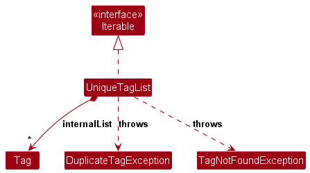

* Table of Contents
{:toc}

--------------------------------------------------------------------------------------------------------------------

## **Acknowledgements**

* This project is based on the [AddressBook-Level3 (AB3)](https://se-education.org/addressbook-level3/) project created by the [SE-EDU initiative](https://se-education.org).

--------------------------------------------------------------------------------------------------------------------

## **Setting up, getting started**

Refer to the guide [_Setting up and getting started_](SettingUp.md).

--------------------------------------------------------------------------------------------------------------------

## **Design**

:bulb: **Tip:** The `.puml` files used to create diagrams are in this document `docs/diagrams` folder. Refer to the [_PlantUML Tutorial_ at se-edu/guides](https://se-education.org/guides/tutorials/plantUml.html) to learn how to create and edit diagrams.

### Architecture

The ***Architecture Diagram*** given above explains the high-level design of the App.

Given below is a quick overview of main components and how they interact with each other.

**Main components of the architecture**

**`Main`** (consisting of classes [`Main`](https://github.com/se-edu/addressbook-level3/tree/master/src/main/java/seedu/address/Main.java) and [`MainApp`](https://github.com/se-edu/addressbook-level3/tree/master/src/main/java/seedu/address/MainApp.java)) is in charge of the app launch and shut down.
* At app launch, it initializes the other components in the correct sequence, and connects them up with each other.
* At shut down, it shuts down the other components and invokes cleanup methods where necessary.

The bulk of the app's work is done by the following four components:

* [**`UI`**](#ui-component): The UI of the App.
* [**`Logic`**](#logic-component): The command executor.
* [**`Model`**](#model-component): Holds the data of the App in memory.
* [**`Storage`**](#storage-component): Reads data from, and writes data to, the hard disk.

[**`Commons`**](#common-classes) represents a collection of classes used by multiple other components.

**How the architecture components interact with each other**

The *Sequence Diagram* below shows how the components interact with each other for the scenario where the user issues the command `remove 1`.

Each of the four main components (also shown in the diagram above),

* defines its *API* in an `interface` with the same name as the Component.
* implements its functionality using a concrete `{Component Name}Manager` class (which follows the corresponding API `interface` mentioned in the previous point.

For example, the `Logic` component defines its API in the `Logic.java` interface and implements its functionality using the `LogicManager.java` class which follows the `Logic` interface. Other components interact with a given component through its interface rather than the concrete class (reason: to prevent outside component's being coupled to the implementation of a component), as illustrated in the (partial) class diagram below.

The sections below give more details of each component.

### UI component

The **API** of this component is specified in [`Ui.java`](https://github.com/se-edu/addressbook-level3/tree/master/src/main/java/seedu/address/ui/Ui.java)

The UI consists of a `MainWindow` that is made up of parts e.g.`CommandBox`, `ResultDisplay`, `PersonListPanel`, `StatusBarFooter` etc. All these, including the `MainWindow`, inherit from the abstract `UiPart` class which captures the commonalities between classes that represent parts of the visible GUI.

The `UI` component uses the JavaFx UI framework. The layout of these UI parts are defined in matching `.fxml` files that are in the `src/main/resources/view` folder. For example, the layout of the [`MainWindow`](https://github.com/se-edu/addressbook-level3/tree/master/src/main/java/seedu/address/ui/MainWindow.java) is specified in [`MainWindow.fxml`](https://github.com/se-edu/addressbook-level3/tree/master/src/main/resources/view/MainWindow.fxml)

The `UI` component,

* executes user commands using the `Logic` component.
* listens for changes to `Model` data so that the UI can be updated with the modified data.
* keeps a reference to the `Logic` component, because the `UI` relies on the `Logic` to execute commands.
* depends on some classes in the `Model` component, as it displays `Person` object residing in the `Model`.

### Logic component

**API** : [`Logic.java`](https://github.com/se-edu/addressbook-level3/tree/master/src/main/java/seedu/address/logic/Logic.java)

Here's a (partial) class diagram of the `Logic` component:

The sequence diagram below illustrates the interactions within the `Logic` component, taking `execute("remove 1")` API call as an example.

:information_source: **Note:** The lifeline for `RemoveCommandParser` should end at the destroy marker (X) but due to a limitation of PlantUML, the lifeline continues till the end of diagram.

How the `Logic` component works:

1. When `Logic` is called upon to execute a command, it is passed to an `AddressBookParser` object which in turn creates a parser that matches the command (e.g., `RemoveCommandParser`) and uses it to parse the command.
1. This results in a `Command` object (more precisely, an object of one of its subclasses e.g., `RemoveCommand`) which is executed by the `LogicManager`.
1. The command can communicate with the `Model` when it is executed (e.g. to delete a person). 
   Note that although this is shown as a single step in the diagram above (for simplicity), in the code it can take several interactions (between the command object and the `Model`) to achieve.
1. The result of the command execution is encapsulated as a `CommandResult` object which is returned back from `Logic`.

Here are the other classes in `Logic` (omitted from the class diagram above) that are used for parsing a user command:

How the parsing works:
* When called upon to parse a user command, the `AddressBookParser` class creates an `XYZCommandParser` (`XYZ` is a placeholder for the specific command name e.g., `AddCommandParser`) which uses the other classes shown above to parse the user command and create a `XYZCommand` object (e.g., `AddCommand`) which the `AddressBookParser` returns back as a `Command` object.
* All `XYZCommandParser` classes (e.g., `AddCommandParser`, `RemoveCommandParser`, ...) inherit from the `Parser` interface so that they can be treated similarly where possible e.g, during testing.

### Model component
**API** : [`Model.java`](https://github.com/se-edu/addressbook-level3/tree/master/src/main/java/seedu/address/model/Model.java)

The `Model` component,

* stores the address book data i.e., all `Person` objects (which are contained in a `UniquePersonList` object).
* stores the currently 'selected' `Person` objects (e.g., results of a search query) as a separate _filtered_ list which is exposed to outsiders as an unmodifiable `ObservableList<Person>` that can be 'observed' e.g. the UI can be bound to this list so that the UI automatically updates when the data in the list change.
* stores a `UserPref` object that represents the user’s preferences. This is exposed to the outside as a `ReadOnlyUserPref` objects.
* does not depend on any of the other three components (as the `Model` represents data entities of the domain, they should make sense on their own without depending on other components)

:information_source: **Note:** An alternative (arguably, a more OOP) model is given below. It has a `Tag` list in the `AddressBook`, which `Person` references. This allows `AddressBook` to only require one `Tag` object per unique tag, instead of each `Person` needing their own `Tag` objects. 

#### UniqueTagList

The class diagram below details the internal structure of `UniqueTagList`:

`UniqueTagList` maintains an `ObservableList<Tag>` internally and enforces uniqueness using case-insensitive equality defined in `Tag#equals`. Adding a duplicate tag throws `DuplicateTagException`, while attempting to remove or retrieve a non-existent tag throws `TagNotFoundException`. The list exposes a read-only view via `asUnmodifiableObservableList()`, which is used by the UI and other components to observe tag changes without mutating the collection.

### Storage component

**API** : [`Storage.java`](https://github.com/se-edu/addressbook-level3/tree/master/src/main/java/seedu/address/storage/Storage.java)

The `Storage` component,
* can save both address book data and user preference data in JSON format, and read them back into corresponding objects.
* inherits from both `AddressBookStorage` and `UserPrefStorage`, which means it can be treated as either one (if only the functionality of only one is needed).
* depends on some classes in the `Model` component (because the `Storage` component's job is to save/retrieve objects that belong to the `Model`)

### Common classes

Classes used by multiple components are in the `seedu.address.commons` package.

--------------------------------------------------------------------------------------------------------------------

## **Implementation**

This section describes some noteworthy details on how certain features are implemented.

### Undo feature

#### Implementation

The undo mechanism is facilitated by `VersionedAddressBook`. It extends `AddressBook` with a state history, stored internally as an `addressBookStateList` and `currentStatePointer`. It implements the following operations:

* `VersionedAddressBook#commit()` — Saves the current address book state in its history.
* `VersionedAddressBook#undo()` — Restores the previous address book state from its history.

These operations are exposed in the `Model` interface as `Model#commitAddressBook()`, `Model#canUndoAddressBook()`, and `Model#undoAddressBook()`.

Given below is an example usage scenario and how undo behaves at each step.

Step 1. The user launches the application for the first time. `VersionedAddressBook` is initialized with the initial address book state, and `currentStatePointer` points to that single state.

Step 2. The user executes a mutating command such as `remove 5`. After successful execution, `LogicManager` compares the pre- and post-command address book states. Since the state changed, it calls `Model#commitAddressBook()`. The new state is saved and `currentStatePointer` advances to the latest state.

Step 3. The user executes another mutating command such as `add n/David ...`. The state changes again, so another snapshot is committed.

:information_source: **Note:** If a command fails its execution, it will not call `Model#commitAddressBook()`, so the address book state will not be saved into the `addressBookStateList`.

Step 4. The user decides the latest change was a mistake and executes `undo`. `UndoCommand` checks `Model#canUndoAddressBook()`. If true, it calls `Model#undoAddressBook()`, shifting `currentStatePointer` left by one and restoring that previous state.

:information_source: **Note:** If `currentStatePointer` is at index 0, there is no previous state to restore. In that case, `undo` returns an error message instead of attempting restoration.

The following sequence diagram shows how an undo operation goes through the `Logic` component:

:information_source: **Note:** The lifeline for `UndoCommand` should end at the destroy marker (X) but due to a limitation of PlantUML, the lifeline reaches the end of diagram.

Similarly, how an undo operation goes through the `Model` component is shown below:

Step 5. If the user performs a new mutating command after an undo, `VersionedAddressBook#commit()` removes all states after `currentStatePointer` before appending the new state. This keeps history linear and consistent with the latest confirmed state.

The following activity diagram summarizes what happens when a user executes a new command:

#### Design considerations:

**Aspect: How undo executes:**

* **Alternative 1 (current choice):** Saves the entire address book.
  * Pros: Easy to implement.
  * Cons: May have performance issues in terms of memory usage.

* **Alternative 2:** Individual command knows how to undo by
  itself.
  * Pros: Will use less memory (e.g. for `delete`, just save the person being deleted).
  * Cons: We must ensure that the implementation of each individual command are correct.

**Aspect: When to commit state:**

* **Alternative 1 (current choice):** `LogicManager` compares pre- and post-command AddressBook state. If different, commits automatically.
  * Pros: No per-command boilerplate — all mutating commands are undoable by default. Adding a new command does not require remembering to call `commit()`.
  * Cons: Requires creating a snapshot of the entire AddressBook before every command execution, even if the command is read-only (e.g., `list`, `find`).

* **Alternative 2:** Each mutating command calls `model.commitAddressBook()` explicitly.
  * Pros: No unnecessary snapshots for read-only commands.
  * Cons: Developers must remember to add the commit call in every new mutating command. Forgetting this silently breaks undo for that command.

### Tag pool design

**Aspect: Tag lifecycle — why a two-step workflow?**

Talently is designed for Applicant Tracking System (ATS) workflows where missing a qualified candidate due to a mistagged record can mean a real business loss. In recruitment, tags drive filtering and shortlisting — if a candidate is tagged `Shotlisted` instead of `Shortlisted`, they silently disappear from filtered views and may never be reviewed. A master tag pool enforces a controlled vocabulary: recruiters pick from a pre-approved list rather than free-typing, eliminating typo-created tags entirely. This is more deliberate than ad-hoc tagging, but the tradeoff is justified because the cost of one missed candidate far outweighs the small overhead of creating tags upfront.

* **Alternative 1 (current choice):** Tags must be created in the tag pool (`tagpool a/TAG`) before assignment (`tag INDEX a/TAG`).
  * Pros: Prevents typo-created tags (e.g., `Shotlisted` vs `Shortlisted`). Ensures canonical casing and a single source of truth for all valid tags. Pool deletion cascades cleanly to all candidates, maintaining referential integrity. Recruiters can view all available tags at a glance.
  * Cons: Extra step for the user — tags must be pre-created before first use.

* **Alternative 2:** Tags are created implicitly when first assigned to a candidate.
  * Pros: Faster for one-off tagging.
  * Cons: Typos create rogue tags that silently fragment the dataset. No centralised view of all available tags. Deletion semantics become ambiguous (delete from one candidate? from all?). In an ATS context, this risks candidates being lost during filtering.

### Duplicate detection design

**Aspect: What constitutes a duplicate candidate?**

* **Alternative 1 (current choice):** Two candidates are duplicates if they share the same phone **or** email.
  * Pros: Catches duplicates even if only one field is shared. Phone numbers and email addresses are strong real-world identifiers.
  * Cons: May flag false positives if two genuinely different people share a phone (e.g., family members using a shared phone).

* **Alternative 2:** Require both phone **and** email to match.
  * Pros: Fewer false positives.
  * Cons: Misses obvious duplicates where only one field was entered differently (e.g., same person with a new email).

### Rejection history design

**Aspect: Why does rejection history persist across status changes?**

In recruitment, a candidate who is rejected for one role may be reconsidered when a different role opens. The recruiter changes their status back to `active` (via `edit INDEX s/active`) and re-enters them into the pipeline. The rejection history and the "Rejected X times" badge intentionally persist through this transition for the following reasons:

1. **"Rejected X times" does not mean "currently rejected."** The badge is a historical counter — the candidate's *current* stage is always indicated by their **status** field (`active`, `rejected`, `hired`, `blacklisted`). Recruiters should always look at the status, not the rejection count, to determine the candidate's current disposition.
2. **Past rejection context is valuable even after hiring.** If a candidate was rejected twice for lack of experience, then eventually hired after gaining more, the recruiter may still want to reference those earlier notes when onboarding or evaluating performance. Erasing the history would lose this context.
3. **Multiple rejection cycles are normal.** Startup hiring is cyclical — the same candidate may apply for three different roles over two years. Each rejection reason (e.g., "Overqualified for junior role", "Timing mismatch", "Failed system design round") provides distinct context. Blocking repeated rejections would force recruiters to use workarounds.
4. **Blacklisting is the appropriate tool for permanent exclusion.** If a candidate should never be contacted again, the recruiter sets their status to `blacklisted` — which blocks further rejection attempts. The rejection history mechanism is not designed for permanent exclusion; it is designed for record-keeping across hiring cycles.

* **Alternative 1 (current choice):** Rejection history accumulates permanently and is visible regardless of status. Consecutive duplicate reasons trigger a warning (not a block) to catch accidental double-entry.
  * Pros: Full audit trail. Supports multi-cycle hiring. Clear separation between "history" and "current status".
  * Cons: A recruiter unfamiliar with the system might initially confuse "Rejected 3 times" with "currently rejected" — mitigated by always displaying the status badge alongside the count.

* **Alternative 2:** Clear rejection history when status changes to `active` or `hired`.
  * Pros: Cleaner appearance for re-activated candidates.
  * Cons: Permanently destroys valuable historical context. No way to recall why the candidate was previously rejected.

### Status lifecycle design

**Aspect: Why can status be freely changed via `edit`?**

Talently allows the recruiter to set any valid status (`active`, `rejected`, `hired`, `blacklisted`) on any candidate at any time via the `edit` command. This is intentional:

* A rejected candidate being reconsidered for a new role can be set back to `active`.
* A hired candidate who leaves the company can be set back to `active` for future roles.
* The `reject` command is a convenience shortcut that sets status to `rejected` *and* appends a reason in one step, but the status itself is always editable independently.
* The only restrictions are: `reject` cannot be used on `hired` or `blacklisted` candidates (the recruiter must explicitly change the status first, ensuring deliberate intent).

### Note management design

**Aspect: Why support add, edit, and delete for notes?**

Notes serve as the recruiter's live scratchpad during calls. Full CRUD (create, read, update, delete) is essential because:

* **Add (`addnote`):** Captures impressions in real time. Auto-timestamping ensures chronological ordering without manual effort.
* **Edit (`editnote`):** Corrects typos or updates details post-call without losing the original timestamp, preserving the chronological record.
* **Delete (`deletenote`):** Removes notes added to the wrong candidate or notes that are no longer relevant. Without delete, the only way to remove an incorrect note would be to delete and re-add the entire candidate — losing all other data.

The original timestamp is always preserved on edit so that the note's position in the chronological timeline remains accurate. If the recruiter wants a "fresh" note, they should delete the old one and add a new one.

--------------------------------------------------------------------------------------------------------------------

## **Documentation, logging, testing, configuration, dev-ops**

* [Documentation guide](Documentation.md)
* [Testing guide](Testing.md)
* [Logging guide](Logging.md)
* [Configuration guide](Configuration.md)
* [DevOps guide](DevOps.md)

--------------------------------------------------------------------------------------------------------------------

## **Appendix: Requirements**

### Product scope

**Target user profile**:
* Recruiters or founders in early-stage startups managing hiring without a formal Applicant Tracking System (ATS).
* Personally interviews and follows up with candidates.
* Frequently takes notes during or immediately after speaking to candidates.
* Needs to revisit past applicants when new roles open.
* Handles a moderate but growing number of contacts (up to 1,000).
* Prefers fast, keyboard-based interaction and CLI (Command Line Interface) over slow, mouse-driven GUI applications.
* Types quickly and values efficiency during active calls.

**Value proposition**:
Talently is a desktop-optimized, keyboard-driven contact management application that helps early-stage recruiters organize candidate details and interview contexts in one centralized place. It eliminates the friction of slow spreadsheet searches and scattered message histories, enabling rapid note-taking during live conversations and instant recall of past candidate interactions, ensuring no promising lead slips through the cracks.

### User stories

Priorities: High (must-have) - `* * *`, Medium (nice-to-have) - `* *`, Low (unlikely to have) - `*`

| Priority | As a …​ | I want to …​                                                                       | So that I can…​ |
|----------|---------|------------------------------------------------------------------------------------|-----------------|
| `* * *` | recruiter | add a candidate with name, phone, email, address, and optional priority/status     | begin tracking them in my talent pool immediately. |
| `* * *` | recruiter | list all candidates alphabetically                                                 | get a full overview of everyone in my talent pool. |
| `* * *` | recruiter | view the complete profile of a specific candidate via a detail panel                | read their full history (notes, tags, status, rejections) in one place before a call. |
| `* * *` | recruiter | search for candidates by partial name, phone, email, note content, or rejection reason | instantly locate a record even if I only remember a fragment of their details. |
| `* * *` | recruiter | edit a candidate’s name, phone, email, address, priority, or status                | keep my records accurate when details change. |
| `* * *` | recruiter | remove a candidate permanently                                                     | delete invalid or withdrawn contacts and stay legally compliant. |
| `* * *` | recruiter | record a rejection with a specific reason that appends to a chronological history   | maintain a full record of why a candidate was passed over across multiple hiring cycles. |
| `* * *` | recruiter | add timestamped notes (with optional heading) to a candidate                       | capture impressions and context immediately during or after a conversation. |
| `* * *` | recruiter | edit an existing note’s content or heading while preserving its timestamp           | correct mistakes without losing the chronological record. |
| `* * *` | recruiter | delete a note from a candidate                                                     | remove outdated or incorrect information and keep records clean. |
| `* * *` | recruiter | assign and remove tags on one or more candidates at once                           | efficiently categorize candidates by role, skill, or hiring stage. |
| `* * *` | recruiter | manage a master tag pool (list, create, and delete tags)                            | enforce a controlled vocabulary and prevent typo-created tags from fragmenting my data. |
| `* *` | recruiter | filter the candidate list by a single tag                                          | focus on a specific hiring subset (e.g., all "Shortlisted" candidates) without visual clutter. |
| `* *` | recruiter | sort candidates by date added (ascending or descending)                            | quickly review the most recent or oldest leads. |
| `* *` | recruiter | sort candidates by priority                                                        | surface high-priority candidates at the top of my list. |
| `* *` | recruiter | set a candidate’s priority flag (high or normal)                                   | visually identify whom to contact first when opening the application. |
| `* *` | recruiter | manage candidate status (active, rejected, hired, blacklisted) via edit            | track each candidate’s current hiring stage and prevent inappropriate outreach. |
| `* *` | recruiter | undo the last modifying action                                                     | instantly recover from an accidental deletion or mistyped command. |
| `* *` | recruiter | redo a previously undone action                                                    | restore a reverted change without retyping it. |
| `* *` | recruiter | clear all data and start fresh                                                     | reset the system when starting a new hiring cycle. |

### Use cases

(For all use cases below, the **System** is `Talently` and the **Actor** is the `recruiter`, unless specified otherwise)

**Use case: UC1 - Adding a candidate**

**Preconditions:** None.

**MSS:**
1. User requests to add a candidate by providing their details.
2. System validates the provided details.
3. System creates the new candidate record and saves it.
4. System informs the user that the candidate was added successfully.
   Use case ends.

**Extensions:**
* 2a. System detects missing mandatory fields or invalid formatting.
    * 2a1. System informs the user of the formatting error and provides the correct command format.
    * Use case ends.
* 2b. System detects that the candidate already exists (matching phone or email).
    * 2b1. System informs the user of the duplicate collision.
    * Use case ends.

**Design justification:** Duplicate detection uses phone OR email (not both) because either field alone is sufficient to uniquely identify a real-world person. This prevents accidental duplicate entries even when only one contact field is shared, while still allowing two candidates with the same name (which is common in practice).

**Use case: UC2 - Removing a candidate**

**Preconditions:** The candidate exists in the system and is shown in the current list.

**MSS:**
1. User requests to remove a specific candidate by index.
2. System validates the index.
3. System removes the candidate and all their associated data (notes, tags, rejection history).
4. System informs the user of the successful removal.
   Use case ends.

**Extensions:**
* 1a. User provides an invalid index (e.g., out of bounds, non-integer, zero).
    * 1a1. System informs the user of the error and provides usage instructions.
    * Use case ends.

**Design justification:** No confirmation prompt is required because the `undo` command can immediately reverse an accidental removal. This keeps the CLI workflow fast and avoids interrupting the recruiter's typing flow.

**Use case: UC3 - Recording a rejection with reason**

**Preconditions:** The candidate exists in the system, is not blacklisted, and is not hired.

**MSS:**
1. User requests to reject a specific candidate by index, providing a rejection reason.
2. System validates the index and the reason.
3. System updates the candidate’s status to REJECTED.
4. System appends the reason to the candidate’s rejection history.
5. System informs the user of the successful update (including total rejection count).
   Use case ends.

**Extensions:**
* 1a. User provides an invalid index.
    * 1a1. System informs the user of the error.
    * Use case ends.
* 2a. User provides an invalid reason (e.g., empty string, exceeds 200 characters, or contains disallowed characters).
    * 2a1. System maintains the candidate’s original status and informs the user of the validation error.
    * Use case ends.
* 2b. The candidate is blacklisted.
    * 2b1. System informs the user that blacklisted candidates cannot be rejected.
    * Use case ends.
* 2c. The candidate has status `hired`.
    * 2c1. System informs the user that hired candidates cannot be rejected.
    * Use case ends.
* 2d. The candidate has a tag named `hired`.
    * 2d1. System shows a confirmation prompt warning about the hired tag.
    * 2d2. User confirms the rejection.
    * Use case resumes from step 3.
* 5a. System detects the same rejection reason as the immediately previous one (case-insensitive).
    * 5a1. System still records the rejection but includes a warning about the consecutive duplicate.
    * Use case ends.

**Design justification:** The system allows rejecting a candidate multiple times (even with the same reason) because real-world hiring involves multiple rounds. Rather than blocking the operation, a warning on consecutive duplicates guards against accidental double-entry while preserving flexibility.

**Use case: UC4 - Filtering candidates by tag**

**Preconditions:** The system contains at least one candidate.

**MSS:**
1. User requests to filter the candidate list by specifying exactly one tag name.
2. System validates the tag format (must start with a letter or number; may contain letters, numbers, or the symbols `. + - _ ( ) @ # ! ? '`; no spaces; 1–30 characters).
3. System filters the list to show only candidates who have that tag assigned (case-insensitive match).
4. System shows the matching candidates with a count.
   Use case ends.

**Extensions:**
* 1a. User specifies an invalid tag format or multiple words.
    * 1a1. System informs the user of the formatting error.
    * Use case ends.
* 3a. No candidates have the specified tag.
    * 3a1. System informs the user that no matching candidates were found.
    * Use case ends.

**Design justification:** Filter accepts exactly one tag to keep the command syntax simple and predictable. Multi-tag filtering can be achieved by chaining `filter` with `find` or by using the tag pool's existing categorisation system.

**Use case: UC5 - Updating candidate information**

**Preconditions:** The target candidate already exists.

**MSS:**
1. User requests to edit specific fields of a candidate.
2. System validates the newly provided information.
3. System updates the candidate record and saves the changes.
4. System informs the user of the successful update.
   Use case ends.

**Extensions:**
* 1a. User specifies an invalid identifier.
    * 1a1. System informs the user of the error.
    * Use case ends.
* 2a. System detects invalid formatting in the newly provided fields.
    * 2a1. System informs the user of the formatting error.
    * Use case ends.
* 2b. System detects the updated details conflict with another existing candidate (duplicate collision on phone or email).
    * 2b1. System aborts the update and informs the user of the specific conflict (which field and which existing candidate).
    * Use case ends.

**Design justification:** The edit command resets the displayed list to show all candidates after a successful edit. This ensures the user can always see the edited candidate in its new position (e.g., if alphabetical sorting moved it). The no-change detection (`"No changes detected"`) prevents unnecessary state commits and keeps the undo history clean. The `edit` command intentionally allows setting any status (including `rejected` or `blacklisted`) without requiring a rejection reason — this enables data migration workflows and quick corrections. The `reject` command is the recommended path for recording rejections with reasons; `edit s/rejected` is a power-user shortcut for status-only changes.

**Use case: UC6 - Finding a candidate by attributes**

**Preconditions:** Candidates exist in the system.

**MSS:**
1. User requests to search for candidates based on a known attribute.
2. System filters the candidate list to include only those matching the provided query.
3. System shows the matching candidates.
   Use case ends.

**Extensions:**
* 1a. User provides an empty or invalid search query.
    * 1a1. System informs the user of the correct command format.
    * Use case ends.
* 2a. No candidates match the search query.
    * 2a1. System informs the user that the result set is empty.
    * Use case ends.

**Design justification:** Search uses OR semantics (matching *any* keyword) and is case-insensitive, so a user who mis-remembers part of a candidate's details can still find them (e.g., `find alice richards` returns both "Alice Davidson" and "Alison Richards"). The search covers name, phone, email, notes, and rejection reasons — the fields most likely to contain recall cues — while excluding address (too noisy, many candidates share common address fragments) and tags (the `filter` command provides exact tag-based filtering, which is more precise than partial keyword matching for structured labels). Keywords are limited to 20 (max 150 characters total) to prevent accidental over-filtering.

**Use case: UC7 - Assigning a tag to a candidate**

**Preconditions:** The candidate exists in the system.

**MSS:**
1. User requests to add a specific tag to a candidate.
2. System validates the tag against the existing tag pool.
3. System appends the tag to the candidate's profile.
4. System informs the user of the success.
   Use case ends.

**Extensions:**
* 1a. User specifies an invalid identifier.
    * 1a1. System informs the user of the error.
    * Use case ends.
* 2a. User specifies an invalid tag format.
    * 2a1. System informs the user of the formatting error.
    * Use case ends.
* 2b. The specified tag does not exist in the system's tag pool.
    * 2b1. System informs the user that the tag must be created before it can be assigned.
    * Use case ends.
* 2c. The candidate already has the specified tag (case-insensitive).
    * 2c1. System rejects the operation and informs the user that the candidate already has the tag.
    * Use case ends.

**Design justification:** Tags must exist in the tag pool before assignment, enforcing a two-step workflow (`tagpool` then `tag`). This registry pattern prevents typos from creating rogue tags and ensures all tag names across candidates are canonically consistent (case-insensitive). The system rejects (rather than silently ignores) duplicate tag assignments to alert the user that their intended action is a no-op.

**Use case: UC8 - Managing the tag pool**

**Preconditions:** None.

**MSS:**
1. User requests to manage the tag pool (list, create, or delete tags).
2. If no arguments are given, system displays all tags currently in the pool (alphabetically sorted). Use case ends.
3. System validates all tag names (must start with a letter or number; may contain letters, numbers, or the symbols `. + - _ ( ) @ # ! ? '`; no spaces; 1–30 characters) and checks for conflicts.
4. System adds new tags to the pool.
5. For any tags being deleted, system removes them from all candidates who currently hold them (cascading deletion).
6. System removes the tags from the pool.
7. System informs the user of the number of tags created and deleted.
   Use case ends.

**Extensions:**
* 2a. A tag to create already exists in the pool.
    * 2a1. System informs the user of the duplicate. No changes are made.
    * Use case ends.
* 2b. A tag to delete does not exist in the pool.
    * 2b1. System informs the user. No changes are made.
    * Use case ends.
* 2c. Same tag appears in both create and delete lists.
    * 2c1. System informs the user of the conflict. No changes are made.
    * Use case ends.
* 2d. Duplicate tag names within the create list (case-insensitive, e.g., `a/Java a/java`).
    * 2d1. System informs the user of the duplicate. No changes are made.
    * Use case ends.
* 2e. Duplicate tag names within the delete list (case-insensitive).
    * 2e1. System informs the user of the duplicate. No changes are made.
    * Use case ends.

**Design justification:** Deleting a tag from the pool cascades to all candidates. This maintains referential integrity — no candidate can hold a tag that doesn't exist in the pool. The cascading sweep uses snapshot iteration to avoid concurrent modification issues. All validations run before any mutations (fail-fast atomicity). Tag discoverability is supported by running `tagpool` with no arguments, which lists all tags in the pool sorted alphabetically. This provides a quick overview without cluttering the UI. Tags are also visible on candidate cards and via `filter TAG`.

**Use case: UC9 - Sorting candidates by date added**

**Preconditions:** At least one candidate exists.

**MSS:**
1. User requests to sort the candidate list by date added, specifying ascending or descending order.
2. System rearranges the list chronologically.
3. System shows the newly sorted list.
   Use case ends.

**Extensions:**
* 1a. The candidate list is empty.
    * 1a1. System informs the user that there is nothing to sort.
    * Use case ends.

**Design justification:** Secondary sort by name (alphabetical) provides a deterministic tiebreaker for candidates added on the same date. The sort modifies the underlying list order (persisted to disk), so it is undoable via `undo`.

**Use case: UC10 - Tagging multiple candidates at once**

**Preconditions:** The target candidates exist in the current displayed list, and the tag exists in the tag pool.

**MSS:**
1. User requests to add or remove tags for multiple candidates using comma-separated indices.
2. System validates all indices, tag names, and checks for conflicts (same tag in both add and delete).
3. System verifies all tags exist in the tag pool.
4. System verifies each candidate's tag state (no duplicate additions, no removing absent tags).
5. System applies tag changes to all specified candidates atomically.
6. System informs the user of success.
   Use case ends.

**Extensions:**
* 2a. Any index is invalid or duplicated.
    * 2a1. System informs the user of the error. No changes are made.
    * Use case ends.
* 2b. Same tag appears in both add and delete lists.
    * 2b1. System informs the user of the conflict. No changes are made.
    * Use case ends.
* 3a. A tag does not exist in the tag pool.
    * 3a1. System informs the user that the tag must be created first. No changes are made.
    * Use case ends.
* 4a. A candidate already has a tag being added, or does not have a tag being removed.
    * 4a1. System informs the user of the specific conflict. No changes are made.
    * Use case ends.

**Design justification:** The command uses fail-fast atomic validation — all checks run before any mutations. This prevents partial updates where some candidates are tagged but others fail, which would leave the system in a confusing state. The max of 10 tags per command prevents abuse while covering realistic batch operations.

**Use case: UC11 - Adding a note to a candidate**

**Preconditions:** The candidate exists in the current displayed list.

**MSS:**
1. User requests to add a note to a candidate by index, providing content and an optional heading.
2. System validates the index and content (must be non-empty; content max 500 characters, heading max 50 characters).
3. System creates a timestamped note and appends it to the candidate's record.
4. System informs the user of success.
   Use case ends.

**Extensions:**
* 1a. User provides an invalid index.
    * 1a1. System informs the user of the error.
    * Use case ends.
* 2a. Content is empty or blank.
    * 2a1. System informs the user that note content is required.
    * Use case ends.
* 2b. Content exceeds 500 characters or heading exceeds 50 characters.
    * 2b1. System informs the user of the character limit.
    * Use case ends.
* 2c. Duplicate `n/` or `h/` prefixes detected.
    * 2c1. System informs the user that duplicate prefixes are not allowed.
    * Use case ends.

**Design justification:** Heading defaults to "General Note" when omitted to keep the common case fast (just `addnote 1 n/content`). Duplicate prefix detection prevents silent data loss where content containing ` n/` would be mis-parsed. Newline characters in pasted content are automatically converted to spaces to prevent JSON formatting issues and ensure single-line display.

**Use case: UC12 - Editing a note**

**Preconditions:** The candidate exists in the current displayed list and has at least one note.

**MSS:**
1. User requests to edit a note by candidate index and note index, providing new content and/or heading.
2. System validates both indices and the provided fields.
3. System updates the note's content and/or heading while preserving the original timestamp.
4. System informs the user of success.
   Use case ends.

**Extensions:**
* 1a. User provides an invalid candidate index or note index.
    * 1a1. System informs the user of the error with the valid range.
    * Use case ends.
* 1b. The candidate has no notes.
    * 1b1. System informs the user that the candidate has no notes.
    * Use case ends.
* 2a. Neither content nor heading is provided.
    * 2a1. System informs the user that at least one field must be provided.
    * Use case ends.
* 2b. Content is blank or exceeds 500 characters, or heading is blank or exceeds 50 characters.
    * 2b1. System informs the user of the constraint violation.
    * Use case ends.

**Use case: UC13 - Deleting a note**

**Preconditions:** The candidate exists in the current displayed list and has at least one note.

**MSS:**
1. User requests to delete a note by candidate index and note index.
2. System validates both indices.
3. System removes the note from the candidate's record.
4. System informs the user of success.
   Use case ends.

**Extensions:**
* 1a. User provides an invalid candidate index or note index.
    * 1a1. System informs the user of the error with the valid range.
    * Use case ends.
* 1b. The candidate has no notes.
    * 1b1. System informs the user that the candidate has no notes.
    * Use case ends.

**Use case: UC14 - Sorting candidates by priority**

**Preconditions:** At least one candidate exists.

**MSS:**
1. User requests to sort candidates by priority, specifying ascending or descending order.
2. System sorts the list (high-priority first for ascending, last for descending).
3. System shows the sorted list.
   Use case ends.

**Extensions:**
* 1a. The candidate list is empty.
    * 1a1. System informs the user that there is nothing to sort.
    * Use case ends.

**Design justification:** Ascending puts high-priority candidates first (most useful default) because `isPriority=true` sorts before `false`. Secondary sort by date-added (newest first) and tertiary by name provide stable, predictable ordering within same-priority groups.

**Use case: UC15 - Clearing all data**

**Preconditions:** None.

**MSS:**
1. User requests to clear all data.
2. System deletes all candidates and the entire tag pool.
3. System informs the user of success.
   Use case ends.

**Design justification:** No confirmation prompt is used for the same reason as remove (UC2) — `undo` provides immediate recovery. The command also clears the tag pool to maintain referential integrity: orphaned tags without candidates would be confusing.

**Use case: UC16 - Undoing the previous action**

**Preconditions:** The user has performed at least one modifying command during the current session.

**MSS:**
1. User requests to undo their previous action.
2. System restores the application data to the state immediately preceding the last modifying command.
3. System resets the displayed list to show all candidates.
4. System informs the user of success.
   Use case ends.

**Extensions:**
* 1a. There are no previous modifying actions to undo in the current session.
    * 1a1. System informs the user that there is nothing to undo.
    * Use case ends.

**Design justification:** Undo uses full-state snapshots (the entire AddressBook is saved before each mutating command). This is simpler and more reliable than per-command inverse logic, at the cost of higher memory usage. For the expected dataset size (up to 1,000 candidates), this trade-off is acceptable.

**Use case: UC17 - Redoing a previously undone action**

**Preconditions:** The user has performed at least one `undo` and has not yet executed a new modifying command.

**MSS:**
1. User requests to redo the previously undone action.
2. System re-applies the undone state.
3. System resets the displayed list to show all candidates.
4. System informs the user of success.
   Use case ends.

**Extensions:**
* 1a. There is no undone action to redo (either no undo was performed, or a new modifying command was executed after undo).
    * 1a1. System informs the user that there is nothing to redo.
    * Use case ends.

**Design justification:** Any new modifying command after `undo` clears the redo history. This linear history model prevents confusing branching states and is consistent with how most mainstream applications handle undo/redo.

**Use case: UC18 - Viewing a candidate's full profile**

**Preconditions:** Candidates exist in the system and are currently shown in a list.

**MSS:**
1. User requests to view the full details of a specific candidate.
2. System validates the identifier.
3. System shows the complete profile of the candidate, including all contact details, tags, notes, and rejection history.
   Use case ends.

**Extensions:**
* 1a. User provides an invalid identifier (e.g., out of bounds, incorrect format).
    * 1a1. System informs the user of the error and provides usage instructions.
    * Use case ends.

### Non-Functional Requirements

1. The system must run flawlessly without requiring an installer on any mainstream Operating System (Windows, macOS, Linux), provided that exactly **Java 17** is installed. The entire application must be packaged as a single portable JAR file not exceeding `100 MB` in size.
2. The application must operate as a standalone, single-user system. It must strictly eschew the use of a Database Management System (DBMS) or any remote server dependencies. All data must be saved locally in a human-editable text file (JSON format) to allow advanced users manual access to their records.
3. The system must be capable of holding up to `1,000` candidate records (including their Rejection History lists and tags) without exceeding `250 MB` of memory footprint or showing noticeable sluggishness in search and filtering operations.
4. The application must prioritize CLI input. A target user with a fast typing speed (60+ WPM) should be able to execute core workflows (e.g., adding a candidate, rejecting a candidate with a reason) entirely via text commands significantly faster than executing the equivalent actions in a standard mouse-driven GUI.
5. All standard data manipulation and retrieval commands must execute, persist to the local file, and update the UI within `200` milliseconds under normal load to prevent disruption of the user's typing flow.
6. The system must automatically save data locally after every mutating command. If a command fails validation halfway through execution (e.g., valid identifier but invalid rejection reason), the system state must remain entirely unchanged to prevent corrupted data.
7. The Graphical User Interface (GUI) must render perfectly without resolution-related artifacts for standard screen resolutions of `1920x1080` (at 100% and 125% scales) and remain fully usable at resolutions of `1280x720` (at 150% scale).
8. The system must function completely independently of an internet connection, ensuring 100% feature availability during automated testing and offline usage.

### Glossary

* **Applicant Tracking System (ATS):** A heavy, enterprise-level software application that enables the electronic handling of recruitment and hiring needs. Talently serves as a lightweight, developer-friendly alternative to this.
* **Candidate:** A person whose details and interaction history are tracked within the system for recruitment purposes.
* **Rejection History:** A chronological list of reasons attached to a candidate detailing why they were previously passed over for roles, allowing recruiters to maintain context across multiple hiring cycles.
* **Tag:** A user-defined keyword or label attached to a candidate (e.g., "Senior", "Java") used for quick categorization and filtering. Must start with a letter or number, followed by letters, numbers, or the symbols `. + - _ ( ) @ # ! ? '` (no spaces, 1–30 characters). Comparison is case-insensitive.
* **Tag Pool:** The master registry of all valid tags in the system. Tags must be created in the pool (`tagpool a/TAG`) before they can be assigned to candidates. Running `tagpool` with no arguments lists all tags. Deleting a tag from the pool cascades the removal to all candidates.
* **Note:** A timestamped text entry attached to a candidate, with an optional heading (max 50 characters) and content (max 500 characters). Notes are ordered chronologically and can be added, edited, or deleted.
* **Status:** A candidate's current stage in the hiring pipeline: `active`, `rejected`, `hired`, or `blacklisted`.
* **Priority:** A boolean flag (`yes`/`no`) indicating whether a candidate is high-priority. High-priority candidates can be surfaced with `sort pr o/asc`.
* **CLI (Command Line Interface):** A text-based user interface used to interact with the software by typing commands rather than clicking graphical elements.
* **Identifier:** The reference used by the recruiter to execute commands on a specific candidate (often an index number representing their position in the current list).
* **JSON (JavaScript Object Notation):** A lightweight, text-based data format used by the system to save and load candidate records locally in a human-readable format.
* **Duplicate Candidate:** A candidate whose phone number or email address matches that of an existing candidate in the system. The `add` and `edit` commands prevent duplicates based on this definition.
* **Mainstream OS:** Windows, Linux, macOS.

--------------------------------------------------------------------------------------------------------------------

## **Appendix: Instructions for manual testing**

Given below are instructions to test the app manually.

:information_source: **Note:** These instructions only provide a starting point for testers to work on;
testers are expected to do more *exploratory* testing.

### Launch and shutdown

1. Initial launch

   1. Download the jar file and copy into an empty folder

   1. Double-click the jar file Expected: Shows the GUI with a set of sample contacts. The window size may not be optimum.

1. Saving window preferences

   1. Resize the window to an optimum size. Move the window to a different location. Close the window.

   1. Re-launch the app by double-clicking the jar file. 
       Expected: The most recent window size and location is retained.

1. Launching with missing data file

   1. Delete the `data/talently.json` file (if it exists) from the app's directory.

   1. Launch the app. 
      Expected: The app starts with sample data. A new `data/talently.json` file is created.

1. Launching with corrupted data file

   1. Open `data/talently.json` and replace its contents with `{ invalid json }`.

   1. Launch the app. 
      Expected: The app starts with an empty address book. The corrupted file is overwritten on the next save.

### Removing a candidate

1. Removing a candidate while all candidates are being shown

   1. Prerequisites: List all candidates using the `list` command. Multiple candidates in the list.

   1. Test case: `remove 1` 
      Expected: First candidate is removed from the list. Details of the removed candidate shown in the result display.

   1. Test case: `remove 0` 
      Expected: No candidate is removed. Error details shown in the result display.

   1. Other incorrect remove commands to try: `remove`, `remove x` (where x is larger than the list size) 
      Expected: Similar to previous.

1. Removing a candidate after filtering

   1. Prerequisites: Use `find` or `filter` to show a subset of candidates. At least one candidate in the filtered list.

   1. Test case: `remove 1` 
      Expected: First candidate in the filtered list is removed. The removal applies to the correct candidate, not the first in the full list.

### Editing a candidate

1. Editing a candidate with valid input

   1. Prerequisites: List all candidates using the `list` command. At least two candidates in the list.

   1. Test case: `edit 1 n/Alice Tan` 
      Expected: First candidate's name is updated to "Alice Tan". Success message shown.

   1. Test case: `edit 1 p/91112222 e/newemail@example.com` 
      Expected: First candidate's phone and email are updated. Success message shown.

   1. Test case: `edit 1 pr/yes` 
      Expected: First candidate's priority is set to high. Success message shown.

1. Editing a candidate with invalid input

   1. Test case: `edit 0 n/Alice` 
      Expected: Error message indicating invalid index.

   1. Test case: `edit 1` 
      Expected: Error message indicating at least one field must be provided.

   1. Test case: Edit the first candidate's phone to match the second candidate's phone. 
      Expected: Error message identifying the conflicting phone number and the existing candidate.

   1. Test case: `edit 1 n/alice` when the first candidate's name is already "alice" (same values). 
      Expected: Message indicating no changes detected.

### Rejecting a candidate

1. Rejecting a candidate with valid input

   1. Prerequisites: List all candidates using the `list` command. At least one active candidate.

   1. Test case: `reject 1 r/Failed technical interview` 
      Expected: Candidate's status changes to REJECTED. Rejection reason is recorded. Success message with rejection count shown.

   1. Test case: Reject the same candidate again with the same reason. 
      Expected: Rejection is recorded but a duplicate warning is shown.

1. Rejecting with invalid input or status

   1. Test case: `reject 0 r/reason` 
      Expected: Error message indicating invalid index.

   1. Test case: `reject 1 r/` (empty reason) 
      Expected: Error message indicating invalid rejection reason.

   1. Test case: Reject a candidate whose status is `hired`. 
      Expected: Error message stating hired candidates cannot be rejected.

   1. Test case: Reject a candidate whose status is `blacklisted`. 
      Expected: Error message stating blacklisted candidates cannot be rejected.

   1. Test case: Reject a candidate who has a tag named `hired` (but whose status is not `hired`). 
      Expected: A confirmation prompt is shown warning about the hired tag. Confirming proceeds with the rejection.

### Adding a note to a candidate

1. Adding a note with valid input

   1. Prerequisites: List all candidates using the `list` command. At least one candidate in the list.

   1. Test case: `addnote 1 n/Strong technical skills. h/Tech Round 1` 
      Expected: A note with heading "Tech Round 1" and content "Strong technical skills." is appended to the first candidate. Timestamp is the current date and time, displayed above the heading when viewed via `show 1`.

   1. Test case: `addnote 1 n/Quick follow-up needed.` 
      Expected: A note with default heading "General Note" is appended. Content is "Quick follow-up needed."

1. Adding a note with invalid input

   1. Test case: `addnote 0 n/content` 
      Expected: Error message indicating invalid index.

   1. Test case: `addnote 1 n/` 
      Expected: Error message indicating note content cannot be empty.

   1. Test case: `addnote 1 n/content n/more` 
      Expected: Error message indicating duplicate prefixes are not allowed.

### Editing a note

1. Editing a note with valid input

   1. Prerequisites: Use `addnote 1 n/Original content h/Original Heading` to add a note to the first candidate. Verify via `show 1`.

   1. Test case: `editnote 1 1 n/Updated content` 
      Expected: Note 1's content changes to "Updated content". Heading and timestamp are preserved.

   1. Test case: `editnote 1 1 h/New Heading` 
      Expected: Note 1's heading changes to "New Heading". Content and timestamp are preserved.

   1. Test case: `editnote 1 1 n/New content h/New Heading` 
      Expected: Both content and heading are updated. Timestamp is preserved.

1. Editing a note with invalid input

   1. Test case: `editnote 1 1` (no content or heading) 
      Expected: Error message indicating at least one field must be provided.

   1. Test case: `editnote 1 99 n/content` (note index out of range) 
      Expected: Error message indicating note index is out of range.

   1. Test case: `editnote 1 1 n/` (blank content) 
      Expected: Error message indicating note content cannot be blank.

### Deleting a note

1. Deleting a note with valid input

   1. Prerequisites: The first candidate has at least one note. Verify via `show 1`.

   1. Test case: `deletenote 1 1` 
      Expected: The first note is deleted from candidate 1. Success message shown.

1. Deleting a note with invalid input

   1. Test case: `deletenote 1 99` (note index out of range) 
      Expected: Error message indicating note index is out of range.

   1. Test case: `deletenote 1 1` when candidate 1 has no notes. 
      Expected: Error message indicating candidate has no notes.

### Managing the tag pool

1. Listing tags in the pool

   1. Test case: `tagpool` (with no arguments, when tags exist) 
      Expected: All tags in the pool are listed alphabetically, e.g., "Tag pool (3 tags): AI, Backend, Frontend".

   1. Test case: `tagpool` (with no arguments, when pool is empty) 
      Expected: Message indicating the tag pool is empty.

1. Adding and removing tags from the pool

   1. Test case: `tagpool a/Frontend` 
      Expected: Tag "Frontend" is added to the pool. Success message displayed.

   1. Test case: `tagpool a/Frontend` (again) 
      Expected: Error message indicating the tag already exists in the pool.

   1. Test case: `tagpool a/Frontend a/frontend` 
      Expected: Error message indicating duplicate tag in the add list (case-insensitive comparison).

   1. Test case: `tagpool d/Frontend` 
      Expected: Tag "Frontend" is removed from the pool and from all candidates who had it.

### Finding candidates

1. Finding by keywords

   1. Prerequisites: Multiple candidates with varying names, notes, and rejection reasons.

   1. Test case: `find John` 
      Expected: All candidates whose name, phone, email, note content/headings, or rejection reasons contain "john" (case-insensitive) are shown.

   1. Test case: `find @#$` 
      Expected: Error message indicating invalid characters. Only letters, digits, and symbols ``- ' . / @ + _ : ; ! ? ( )`` are allowed.

### Saving data

1. Dealing with missing/corrupted data files

   1. To simulate a missing file: delete `data/talently.json` and relaunch the app. 
      Expected: The app starts with sample data.

   1. To simulate a corrupted file: open `data/talently.json` and add invalid JSON syntax (e.g., delete a closing brace). 
      Expected: The app starts with an empty address book.

   1. To simulate invalid field values: open `data/talently.json` and change a note's date to `"2025-02-30T10:00:00"` (invalid date). 
      Expected: The app starts with an empty address book (graceful recovery).

   1. To simulate a future note date: open `data/talently.json` and change a note's date to a far-future value such as `"2099-01-01T00:00:00"`. 
      Expected: The app loads normally. The affected note's timestamp is silently clamped to the time of loading. A warning is written to the log. No data is lost.

   1. To simulate a future candidate date: open `data/talently.json` and change a candidate's `dateAdded` to a far-future value such as `"01/01/2099 00:00 +0800"`. 
      Expected: The app loads normally. The affected candidate's `dateAdded` is silently clamped to the time of loading. A warning is written to the log. No data is lost.

   1. To simulate orphaned tags: open `data/talently.json` and add a tag to a person that does not exist in the `"tags"` pool array. 
      Expected: The app starts with an empty address book (graceful recovery).
